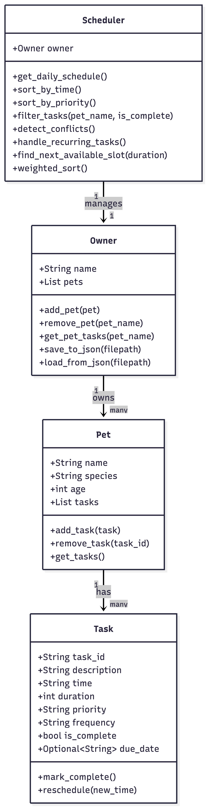
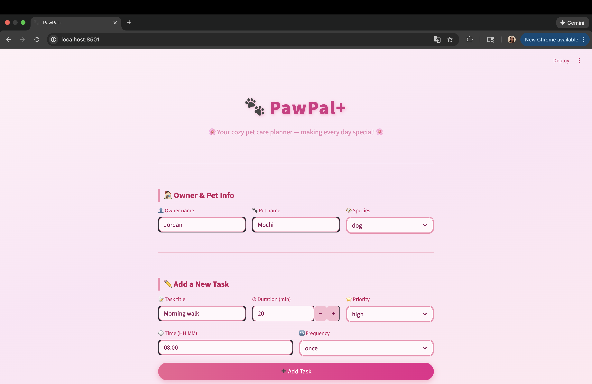
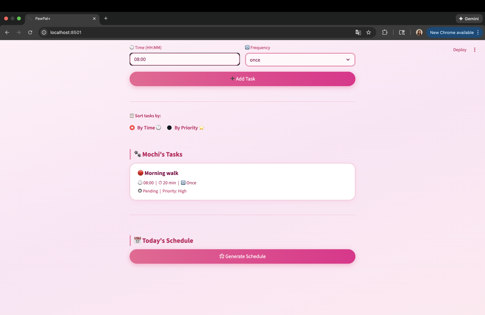

# PawPal+ (Module 2 Project)

You are building **PawPal+**, a Streamlit app that helps a pet owner plan care tasks for their pet.

## Scenario

A busy pet owner needs help staying consistent with pet care. They want an assistant that can:

- Track pet care tasks (walks, feeding, meds, enrichment, grooming, etc.)
- Consider constraints (time available, priority, owner preferences)
- Produce a daily plan and explain why it chose that plan

Your job is to design the system first (UML), then implement the logic in Python, then connect it to the Streamlit UI.

## What you will build

Your final app should:

- Let a user enter basic owner + pet info
- Let a user add/edit tasks (duration + priority at minimum)
- Generate a daily schedule/plan based on constraints and priorities
- Display the plan clearly (and ideally explain the reasoning)
- Include tests for the most important scheduling behaviors

## Getting started

### Setup

```bash
python -m venv .venv
source .venv/bin/activate  # Windows: .venv\Scripts\activate
pip install -r requirements.txt
```

### Suggested workflow

1. Read the scenario carefully and identify requirements and edge cases.
2. Draft a UML diagram (classes, attributes, methods, relationships).
3. Convert UML into Python class stubs (no logic yet).
4. Implement scheduling logic in small increments.
5. Add tests to verify key behaviors.
6. Connect your logic to the Streamlit UI in `app.py`.
7. Refine UML so it matches what you actually built.

---

## Features

- **Task Management** — Add pet care tasks with title, time, duration, priority, and frequency
- **Daily Schedule** — Generate a chronologically sorted daily schedule across all pets
- **Sort by Priority** — Re-order tasks by priority level (High → Medium → Low)
- **Conflict Warnings** — Automatically detect and display tasks scheduled at the same time
- **Recurring Tasks** — Daily and weekly tasks automatically reschedule after completion
- **Find Next Available Slot** — Suggest the next free time slot given a required duration
- **Weighted Sort** — Rank tasks by a combined score of priority and time of day
- **Data Persistence** — Owner, pet, and task data is saved to `data.json` and reloaded on startup
- **Pink Cozy UI** — A warm, friendly Streamlit interface with color-coded priority indicators

---

## Smarter Scheduling

PawPal+ goes beyond a simple task list with intelligent scheduling features:

- **Sort by time** uses Python's `sorted()` with a lambda key on the `"HH:MM"` time string
- **Sort by priority** maps High/Medium/Low to numeric weights (0/1/2) for ordering
- **Conflict detection** flags any two tasks sharing the exact same start time
- **Recurring tasks** use Python's `timedelta` to calculate the next due date (today + 1 day for daily, today + 7 days for weekly)
- **Find next available slot** scans task intervals from 06:00–22:00 and returns the first gap large enough for the requested duration
- **Weighted sort** combines priority score (High=3, Medium=2, Low=1) and time-of-day score to rank tasks by overall importance

---

## 📸 Demo





---

## Testing PawPal+

Run the test suite with:

```bash
python -m pytest
```

### What the tests cover

- `test_mark_complete_sets_true` — Verifies that `mark_complete()` sets `is_complete` to `True`
- `test_add_task_increases_count` — Verifies that adding a task increases the pet's task count by 1
- `test_sort_by_time_returns_chronological_order` — Verifies tasks are returned in chronological order
- `test_handle_recurring_tasks_creates_next_day_task` — Verifies that completing a daily task creates a new task for the following day
- `test_detect_conflicts_flags_same_time` — Verifies that two tasks at the same time trigger a conflict warning

### Confidence Level

(4/5) — Core behaviors are verified. Edge cases like empty pet task lists and invalid time formats would be tested in a future iteration.

## Challenges Completed

- **Challenge 1 (Advanced Algorithm)** — Implemented `find_next_available_slot()` and `weighted_sort()` using Copilot Agent Mode to plan and generate the logic.
- **Challenge 2 (Data Persistence)** — Used Agent Mode to add `save_to_json()` and `load_from_json()` to the Owner class, and wired it into Streamlit session state.
- **Challenge 3 (Priority Scheduling + UI)** — Added priority-based sorting and color-coded task cards (🔴🟡🟢) in the Streamlit UI.
- **Challenge 4 (Professional UI)** — Redesigned the full UI with a pink cozy theme, emoji indicators, and card-based task display.


